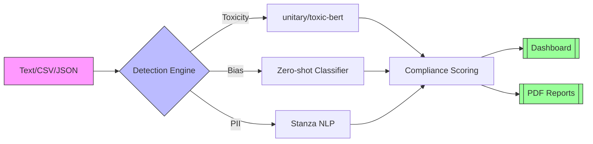

# 🛡️ EU AI Compliance Analyzer

[](https://yourapp.streamlit.app)
[](https://opensource.org/licenses/MIT)

Automated detection of GDPR and EU AI Act violations in AI-generated content, with specialized support for Italian regulations.


## Features

- **Multi-Format Input**: Analyze text, CSV, or JSON inputs
- **Comprehensive Detection**:
  - ✅ Toxicity (using `unitary/toxic-bert`)
  - ✅ Bias (zero-shot classification)
  - ✅ PII (Stanza NLP + regex)
- **Regulatory Alignment**:
  - GDPR Article 5/17/22 compliance
  - EU AI Act risk classification
  - Italian Garante Privacy guidelines
- **Professional Reporting**:
  - Interactive visualizations
  - PDF/CSV/JSON exports
  - Audit-ready documentation


    
## Quick Start

```bash
# Clone repository
git clone https://github.com/yourusername/ai-compliance-analyzer.git
cd ai-compliance-analyzer

# Install dependencies
pip install -r requirements.txt

# Download language models
python -m stanza download en it

# Launch app
streamlit run app.py
